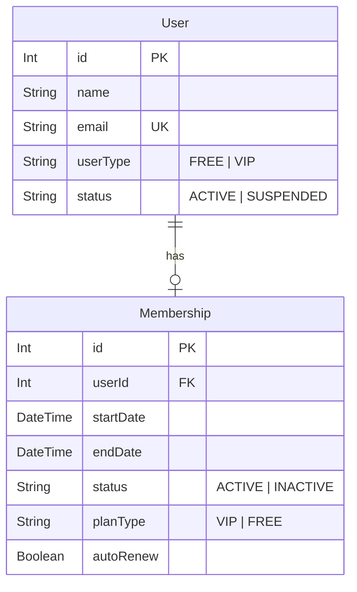
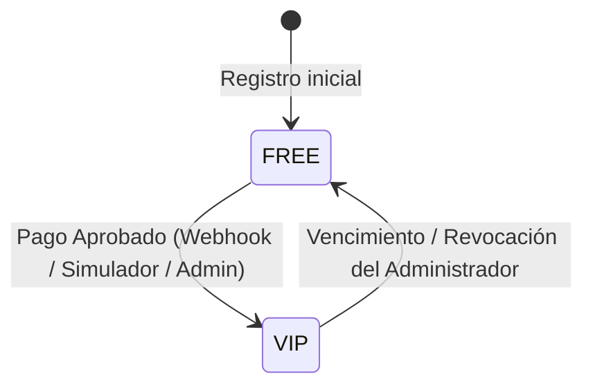
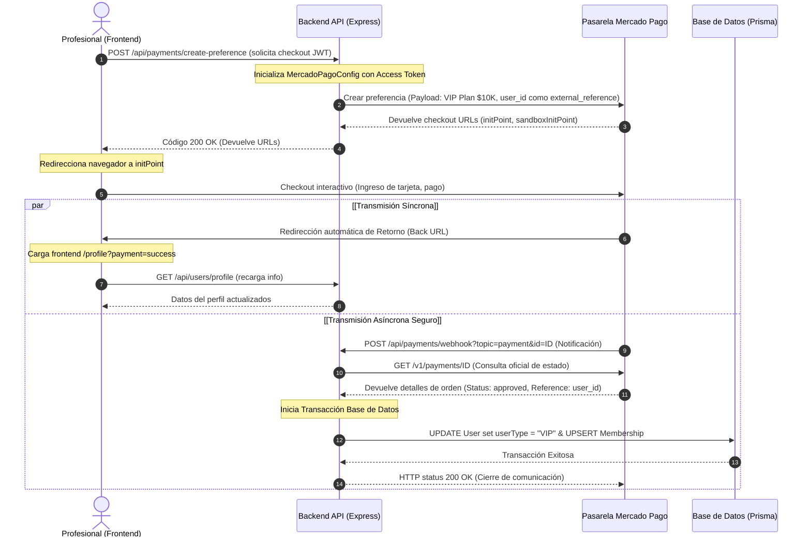

# Informe Técnico de Auditoría: Integración con Mercado Pago - PresuApp v1.0.0

Este documento contiene un análisis exhaustivo y detallado del estado de integración de la pasarela de pagos Mercado Pago en la aplicación PresuApp (Frontend y Backend).

> [!IMPORTANT]
> **Aclaración sobre el objetivo de la integración:**  
> Actualmente, la integración con Mercado Pago está diseñada exclusivamente para que el **profesional (usuario administrador/proveedor del servicio) adquiera la suscripción mensual Plan VIP** para habilitar accesos ilimitados. **No existe en el código actual una funcionalidad para que los clientes paguen por los presupuestos (budgets)** generados en la plataforma.

---

## 1. ESTRUCTURA DE LA INTEGRACIÓN

A continuación se listan los elementos por capas (Clean Architecture en Backend y SPA en Frontend) que participan en el flujo de pagos.

### Archivos Involucrados
*   **Frontend:**
    *   `presuapp-front/src/pages/Profile.jsx` (Componente de perfil, inicio de checkout y simulación).
    *   `presuapp-front/src/api/axios.js` (Configuración del cliente HTTP para la comunicación con las APIs).
*   **Backend:**
    *   `src/interfaces/routes/payment.routes.js` (Declaración de endpoints).
    *   `src/interfaces/controllers/PaymentController.js` (Orquestador de solicitudes/respuestas).
    *   `src/application/use-cases/PaymentUseCases.js` (Reglas de negocio e interacción con SDK MP).
    *   `src/infrastructure/repositories/PrismaUserRepository.js` (Consultas y transacciones de persistencia).
    *   `prisma/schema.prisma` (Definición de modelos de base de datos relacionales).
    *   `package.json` (Declaración del SDK de Mercado Pago npm).

### Controladores Existentes
*   `PaymentController` (`src/interfaces/controllers/PaymentController.js`):
    *   `createPreference(req, res, next)`: Gestiona la solicitud de creación de orden de pago.
    *   `webhook(req, res, next)`: Recibe eventos asincrónicos desde Mercado Pago.
    *   `simulateSuccessPayment(req, res, next)`: Endpoint auxiliar para simular localmente un pago aprobado.

### Rutas Existentes
*   `POST /api/payments/create-preference` - Generación de sesión checkout (Protegida por autenticación).
*   `POST /api/payments/webhook` - Endpoint público expuesto para notificaciones asincrónicas de MP.
*   `POST /api/payments/simulate-success` - Endpoint protegido de desarrollo para simulación de flujo completo localmente.

### Casos de Uso Existentes
*   `PaymentUseCases` (`src/application/use-cases/PaymentUseCases.js`):
    *   `createPreference(user)`: Lógica para estructurar el payload de preferencia de pago y llamar al SDK.
    *   `processWebhook(paymentId, topicAction)`: Lógica para verificar los detalles de una transacción mediante el SDK y aplicar la correspondiente actualización de membresía en persistencia.

### Servicios Existentes
*   `PrismaUserRepository` (`src/infrastructure/repositories/PrismaUserRepository.js`):
    *   `updateMembership(userId, membershipData)`: Cambia la categoría del usuario (`FREE` a `VIP`) y crea o actualiza su membresía con el período de vigencia dentro de una transacción segura de base de datos.
*   `PrismaClient` (Cliente ORM utilizado en los repositorios).

### Modelos de Base de Datos Participantes
*   `User`: Representa al profesional. Participa con los campos `id`, `email`, `name`, `userType` (determina si es `"FREE"` o `"VIP"`).
*   `Membership`: Representa los términos de la suscripción VIP del usuario profesional. Campos: `id`, `userId`, `startDate`, `endDate`, `status` (`ACTIVE`/`INACTIVE`), `planType` (`VIP`/`FREE`), `autoRenew`.

---

## 2. CONFIGURACIÓN DEL SDK DE MERCADO PAGO

El backend utiliza la librería oficial de Mercado Pago para Node.js.

*   **Versión del SDK utilizada:** `"mercadopago": "^3.2.0"` (según `package.json`). Corresponde a la versión moderna V3 del SDK de JavaScript.
*   **Inicialización:** Se instancia en el constructor de `PaymentUseCases` (`src/application/use-cases/PaymentUseCases.js`):
    ```javascript
    this.mpClient = new MercadoPagoConfig({
      accessToken: process.env.MP_ACCESS_TOKEN || 'APP_USR-TEST-MERCADOPAGO-ACCESS-TOKEN'
    });
    this.preference = new Preference(this.mpClient);
    this.payment = new Payment(this.mpClient);
    ```
*   **Origen del Access Token:** Se recupera de la variable de entorno `process.env.MP_ACCESS_TOKEN`.
*   **Credenciales hardcodeadas:** Sí, existe un valor por defecto (fallback) en caso de que la variable de entorno no esté configurada:
    `'APP_USR-TEST-MERCADOPAGO-ACCESS-TOKEN'` (Token de prueba dummy).

---

## 3. CREACIÓN DE LA PREFERENCIA (PREFERENCE)

El flujo se desencadena en el backend dentro del método `createPreference(user)` de `PaymentUseCases.js`:

*   **Generación:** Se utiliza el cliente instanciado del SDK `this.preference.create(preferenceData)`.
*   **Datos y Campos Enviados:**
    *   `items`: Contiene un único ítem fijo correspondiente a la membresía de la plataforma:
        *   `id`: `'plan-vip'`
        *   `title`: `'PresuApp - Plan VIP (Suscripción Mensual)'`
        *   `quantity`: `1`
        *   `unit_price`: `10000`
        *   `currency_id`: `'ARS'`
    *   `payer`: Datos del usuario actual autenticado:
        *   `email`: `user.email`
        *   `name`: `user.name`
    *   `external_reference`: Almacena el ID del usuario en formato String (`String(user.id)`). Esto es crucial para identificar qué usuario profesional realizó el pago al recibir el webhook.
    *   `back_urls`: Redirecciones de navegación para el cliente:
        *   `success`: `${process.env.FRONTEND_URL}/profile?payment=success`
        *   `failure`: `${process.env.FRONTEND_URL}/profile?payment=failure`
        *   `pending`: `${process.env.FRONTEND_URL}/profile?payment=pending`
    *   `auto_return`: Establecido en `'approved'`. Si el pago es aprobado, Mercado Pago redirige automáticamente al usuario a la URL de éxito en pocos segundos.
    *   `notification_url`: Dirección a la cual la API de Mercado Pago publica los webhooks de estado:
        *   `${process.env.BACKEND_URL}/api/payments/webhook` (usando por defecto `https://presuapp.locallink.sh/api/payments/webhook` si la variable de entorno no existe).
    *   **¿Utiliza metadata?** No. El payload no especifica campo de metadata personalizado, sino que utiliza el campo estándar `external_reference` para vincular la orden con el usuario local.

---

## 4. PASO A PASO DEL FLUJO DE PAGO ACTUAL

Debido a que actualmente no existe pago de presupuestos, el flujo se basa en la adquisición del Plan VIP de la plataforma por parte de un profesional:

1.  **Ingreso del Profesional:** El profesional inicia sesión con sus credenciales, accede a la sección de **Configuración de Perfil** (`/profile`).
2.  **Solicitud de Upgrade:** En la sección "Membresía y Estado", el usuario ve un anuncio promocional y presiona el botón **"Obtener VIP — $10.000 / mes"**.
3.  **Ejecución del Endpoint:** Se dispara en el frontend un método `handleUpgrade` que realiza un `HTTP POST` al endpoint protegido del backend: `/api/payments/create-preference`.
4.  **Respuesta del Backend:** El backend valida el JWT, crea la preferencia con el SDK de Mercado Pago y responde un código de estado `200 OK` con el siguiente esquema JSON:
    ```json
    {
      "success": true,
      "data": {
        "preferenceId": "ID-PREFERENCIA-MERCADOPAGO",
        "initPoint": "https://www.mercadopago.com.ar/checkout/v1/redirect?pref_id=...",
        "sandboxInitPoint": "https://sandbox.mercadopago.com.ar/checkout/v1/redirect?pref_id=..."
      }
    }
    ```
5.  **Apertura del Checkout:** En la respuesta exitosa del frontend, se redirige el navegador del usuario asignando la URL a `window.location.href = initPoint`. Esto redirecciona al usuario directamente fuera de la aplicación, abriendo el checkout nativo de Mercado Pago.
6.  **Finalización de Pago:**
    *   **Retorno al Frontend:** El usuario completa la transacción. Mercado Pago lo redirige automáticamente a la página de perfil con un parámetro en la URL (ej. `?payment=success`). El frontend detecta este parámetro, muestra una alerta verde ("¡Suscripción VIP Activada!") y refresca el perfil (`refreshProfile()`) para actualizar el layout.
    *   **Procesamiento Asincrónico:** En paralelo, Mercado Pago notifica al webhook del Backend para confirmar y actualizar la base de datos de manera definitiva.

---

## 5. DIAGNÓSTICO DE WEBHOOKS (NOTIFICACIÓN ASÍNCRONA)

**¿Existe un webhook operativo?**  
Sí, está desarrollado y en funcionamiento en el backend.

*   **Ruta expuesta:** `/api/payments/webhook` (Post público).
*   **Controlador asociado:** `PaymentController.webhook` (`src/interfaces/controllers/PaymentController.js`).
*   **Eventos procesados:** Filtra eventos por el campo `topic` o `type`. Aquellos de interés que contengan:
    *   `payment`
    *   `payment.created`
    *   `payment.updated`
    *   Acciones del cuerpo de la petición que comiencen con `'payment'`.
*   **Flujo ante la recepción de notificación:**
    1.  Recibe el webhook y extrae el `paymentId` (independientemente si viene en query params, body type o parámetros anidados).
    2.  Invoca `PaymentUseCases.processWebhook(paymentId, topic)`.
    3.  El caso de uso efectúa una llamada segura externa a la API de Mercado Pago: `this.payment.get({ id: paymentId })`.
    4.  Si el checkout devuelve un estado aprobado (`status: 'approved'`), extrae el ID de usuario desde `external_reference` (originalmente enviado durante la creación).
    5.  Calcula un rango de 30 días adicionales para la membresía activa.
    6.  Llama a `PrismaUserRepository.updateMembership(userId, membershipData)`.
*   **Datos Actualizados en Base de Datos:**
    *   Actualiza el campo `userType` en la tabla `User` (a `"VIP"`).
    *   Actualiza o crea (upsert) un registro en la tabla `Membership` asociando la fecha de inicio (`startDate`), fecha de expiración (`endDate`), estado (`status: "ACTIVE"`), tipo de membresía (`planType: "VIP"`) y `autoRenew: true`.

---

## 6. MODELADO EN BASE DE DATOS Y RELACIONES

El almacenamiento y control de accesos se gestiona en las tablas de usuarios y membresías. **No existe un modelo Payment en base de datos; la traza de compras no se almacena históricamente.**



*   **Modelos involucrados:** `User` y `Membership`.
*   **Relación:** Relación uno a uno (`User.id` mapea con `Membership.userId` con restricción única).
*   **Campos clave para el flujo:**
    *   `User.userType`: En base a este campo, el frontend y las validaciones de negocio limitan la creación de catálogos y presupuestos.
    *   `Membership.endDate`: Fecha límite de concesión VIP.

---

## 7. ESTADOS ADMITIDOS Y FLUJO DE TRANSICIÓN

### Estados de Membresía e Roles de Usuario
*   **Tipos de Suscripción (Usuario):**
    *   `"FREE"`: Plan de bienvenida (aplicado por defecto).
    *   `"VIP"`: Plan Premium activo obtenido a través del pago con Mercado Pago o asignación manual de administración.
*   **Estados de Membresía (Tabla Membership):**
    *   `"ACTIVE"`: Membresía con privilegios VIP habilitados en el período vigente.
    *   `"INACTIVE"`: Suscripción inactiva/vencida.

### Estados de Pago de Mercado Pago
La integración procesa el estado del pago mediante el SDK directamente desde la API oficial de Mercado Pago:
*   `'approved'`: El único estado procesado. Modifica la cuenta del profesional a `"VIP"`.
*   **Otros estados (pending, rejected, in_process, cancelled):** No se manejan explícitamente en el backend. Si el estado de la API no es `'approved'`, no se altera la base de datos y la membresía continuará inalterada (o gratis si era su estado original).



---

## 8. INTEGRACIÓN EN EL FRONTEND

El proceso completo se concentra de forma centralizada en el componente del perfil de usuario profesional.

*   **Ubicación del Botón:** `Profile.jsx` (`presuapp-front/src/pages/Profile.jsx`).
*   **Componente:** Utiliza el componente común `<Button>` importado de la biblioteca de diseño interno, renderizado dinámicamente con estilos personalizados.
*   **Información / Parámetros Recibidos:**
    *   Recibe del contexto de sesión (`useAuth` hook) el estado completo del usuario actual (`user`).
    *   Interpreta los parámetros de búsqueda de la URL actual mediante el hook `useSearchParams` (`searchParams.get('payment')`), lo que condiciona la renderización de carteles contextuales:
        *   Si es `?payment=success`: Alerta verde informando que el plan VIP está activado.
        *   Si es `?payment=failure`: Alerta roja notificando cancelación o error.
*   **¿Cómo consulta el estado del pago?**  
    El frontend no realiza polling activo del estado detallado del pago al backend. En su lugar:
    1.  Mercado Pago redirige al cliente a la URL de éxito con parámetros Query.
    2.  El frontend lee el parámetro y ejecuta `refreshProfile()` de forma inmediata.
    3.  Esta petición consulta la ficha de perfil en la base de datos (donde el webhook asíncrono idealmente ya ha activado la membresía), actualizando los datos del contexto global del usuario.

*   **Botón de Simulación de Pago:** Para pruebas locales rápidas, el frontend renderiza un disparador debajo del flujo nativo que llama a `/api/payments/simulate-success` e inmediatamente asume un estado aprobado, facilitando la fase de depuración.

---

## 9. EVALUACIÓN DE SEGURIDAD

Se detectan las siguientes condiciones de validación y protección dentro de los endpoints involucrados:

1.  **Protección de Endpoints:**
    *   El endpoint de creación `/create-preference` requiere autenticación robusta mediante el middleware global `protectRoute`. Solo profesionales identificados por su token JWT firmado pueden iniciar flujos.
    *   El endpoint de simulación `/simulate-success` está igualmente protegido por `protectRoute`.
2.  **Validación de Webhooks:**
    *   El endpoint de webhook `/webhook` es público por diseño técnico para admitir llamadas externas.
    *   **Medida de seguridad pasiva implementada:** Para evitar suplantaciones de Webhooks (falsificación de pagos mediante inyección de payloads fraudulentos), el controlador no asume ciegamente los datos del cuerpo de la petición. Ante cualquier notificación, el backend realiza una petición directa saliente hacia los servidores oficiales de Mercado Pago utilizando `this.payment.get({ id })` para obtener la información oficial verídica de la orden de pago directamente de la pasarela. Solo si esa respuesta oficial de Mercado Pago confirma que el estado fue `'approved'` y el cobro ocurrió, se actualiza el registro del usuario.

> [!WARNING]
> **Detalle crítico de seguridad en la simulación:**  
> En el método de webhook `processWebhook(paymentId, topicAction)` de `PaymentUseCases.js`, cuando se detecta un entorno de desarrollo no productivo (ej., `process.env.NODE_ENV !== 'production'`), la simulación de cobro tiene un comportamiento cableado de la siguiente manera:
> ```javascript
> if (process.env.NODE_ENV !== 'production' && (String(paymentId).startsWith('test') || String(process.env.MP_ACCESS_TOKEN).includes('TEST'))) {
>   console.log('Simulación de pago exitosa en entorno de pruebas local.');
>   paymentInfo = {
>     status: 'approved',
>     external_reference: '1' // Mapea al usuario id: 1
>   };
> }
> ```
> Notar que el campo `external_reference` está hardcodeado con el valor `'1'`. Esto significa que si un profesional autenticado con ID `5` ejecuta la simulación de pago, la membresía VIP se aplicará de forma fija al usuario con ID `1` en lugar del usuario que ejecutó la prueba.

---

## 10. FUNCIONALIDADES IMPLEMENTADAS (YA FUNCIONA)

A la fecha de esta auditoría técnica, las siguientes características operan de forma correcta:

*   ✅ **Integración del SDK de Mercado Pago v3:** Implementado en Node.js usando la estructura moderna de inicialización de biblioteca JavaScript con configuración unificada (`MercadoPagoConfig`).
*   ✅ **Creación Dinámica de Preferencias:** Creación programática de la sesión de checkout mediante API REST.
*   ✅ **Definición de Clientes y Precios VIP:** Payload parametrizado con un plan base de $10.000 ARS y datos automáticos del profesional autenticado en la plataforma.
*   ✅ **Asociación de Usuario (External Reference):** Mapeo de sesión mediante envío del ID del profesional en `external_reference`.
*   ✅ **Navegación Controlada (Back URLs):** Transición automática y manual asistida a las vistas correspondientes dentro del panel del frontend ante éxito o error.
*   ✅ **Recepción de Notificaciones Webhook IPN:** Endpoint público para atender callbacks de actualizaciones del estado de cobros de Mercado Pago.
*   ✅ **Consulta y Validación Segura de Pagos:** Implementación contra la API oficial para validar que solo pagos reales y acreditados modifiquen los estados en base de datos.
*   ✅ **Transaccionalidad en Repositorios:** Actualización aislada y segura mediante `$transaction` en Prisma para garantizar consistencia entre el cambio en User y el registro histórico en Membership.
*   ✅ **Consola Administrativa de Planes:** Muestra estadísticas en tiempo real y permite de manera manual promover usuarios a VIP o degradarlos a FREE.
*   ✅ **Simulador de Desarrollo Integrado:** Flujo local simplificado que omite la necesidad de levantar túneles reverse-proxy HTTPS (como ngrok o locallink) durante la fase de depuración inicial.

---

## 11. FUNCIONALIDADES FALTANTES O MEJORAS RECOMENDADAS

Se listan las sugerencias para elevar la estabilidad, mantenimiento y seguridad de la arquitectura de cobros:

*   ❌ **Ausencia de Historial de Transacciones (Modelo Payment):** Actualmente, no hay ningún registro en base de datos de las transacciones facturadas. Si un usuario paga, su membresía se actualiza a VIP y se registra en `Membership`, pero no queda un registro contable de cobros asociados a códigos de transacción de Mercado Pago, montos históricos cobrados, fechas ni auditoría de ingresos.
*   ❌ **Ausencia de Tarea Cron de Expiración:** Aunque las membresías se crean con una fecha `endDate` válida a 30 días, no existe un script en segundo plano (Cron job, batch worker, etc.) que corra periódicamente en el backend desactivando las membresías expiradas y regresando su estado a `FREE`.
*   ❌ **Vulnerabilidad de Simulación en Producción:** El controlador `PaymentController.simulateSuccessPayment` permite a cualquier usuario ejecutar el simulador. Aunque el caso de uso está blindado para responder solo si `NODE_ENV !== 'production'`, el endpoint sigue expuesto públicamente en producción; debería restringirse o deshabilitarse a nivel de middleware en producción.
*   ❌ **Código de ID de Usuario Hardcodeado en Simulación:** Corregir el simulador para usar el ID del usuario actual dinámicamente en lugar del valor fijo `'1'`.
*   ❌ **Filtro de Seguridad de Firmas de Webhook:** Mercado Pago envía firmas criptográficas en las cabeceras del webhook (ej., `x-signature`). La integración actual no valida estas firmas, sino que se apoya en realizar una petición externa GET por cada webhook. Integrar validación de firmas ahorraría llamadas de red y mejoraría la resistencia a ataques de denegación de servicio (DoS).
*   ❌ **Notificación de Vencimientos:** No se cuenta con alertas o emails automáticos al usuario profesional avisándole que su suscripción VIP expira en pocos días.

---

## 12. DIAGRAMA DE FLUJO DEL PROCESO

El siguiente esquema detalla el ciclo de vida del pago, desde su solicitud en el panel de control del perfil del profesional hasta la actualización final en la base de datos PostgreSQL:



---

## 13. CONCLUSIÓN Y RECOMENDACIONES DE PRODUCCIÓN

### Porcentaje estimado de completitud
La integración actual se encuentra en un **80% de su implementación base**.  
La comunicación ida y vuelta con la pasarela, la inicialización del SDK moderno de Mercado Pago, la redirección y el webhook asíncrono para verificar pagos reales están correctamente implementados.

### Prioridades para puesta en producción

Para que la integración con Mercado Pago quede formalmente lista para producción con los estándares requeridos, se aconseja priorizar las siguientes tareas:

1.  **Prioridad Crítica (Bloqueante):**
    *   **Desarrollar la Tarea de Expiración de Planes:** Implementar una lógica en segundo plano (usando por ejemplo `node-cron` o similar) que revise diariamente aquellas membresías cuyo `endDate` sea menor a la hora actual y actualice los campos `User.userType` a `"FREE"` y `Membership.status` a `"INACTIVE"`. De lo contrario, un profesional VIP lo seguirá siendo indefinidamente a pesar del vencimiento.
    *   **Configurar variables de entorno reales:** Asegurar la declaración correcta en producción de `MP_ACCESS_TOKEN`, `FRONTEND_URL` y `BACKEND_URL`.
2.  **Prioridad Media (Estabilidad y Auditoría):**
    *   **Crear el modelo `PaymentTransaction`:** Rediseñar la base de datos agregando un modelo para llevar la contabilidad interna de cada pago validado. Esto prevendrá problemas de soporte y quejas de cobros no acreditados.
    *   **Corregir la Simulación Local:** Cambiar el hardcodeo de `external_reference: '1'` por el ID de usuario dinámico que realiza la prueba para evitar sobreecrituras cruzadas accidentales en base de datos.
3.  **Prioridad Baja (Seguridad e Interfaz):**
    *   Implementar validación criptográfica de firmas de webhook en cabeceras HTTP.
    *   Agregar un sistema de notificaciones automáticas vía email informando al usuario sobre vencimientos aproximados.
