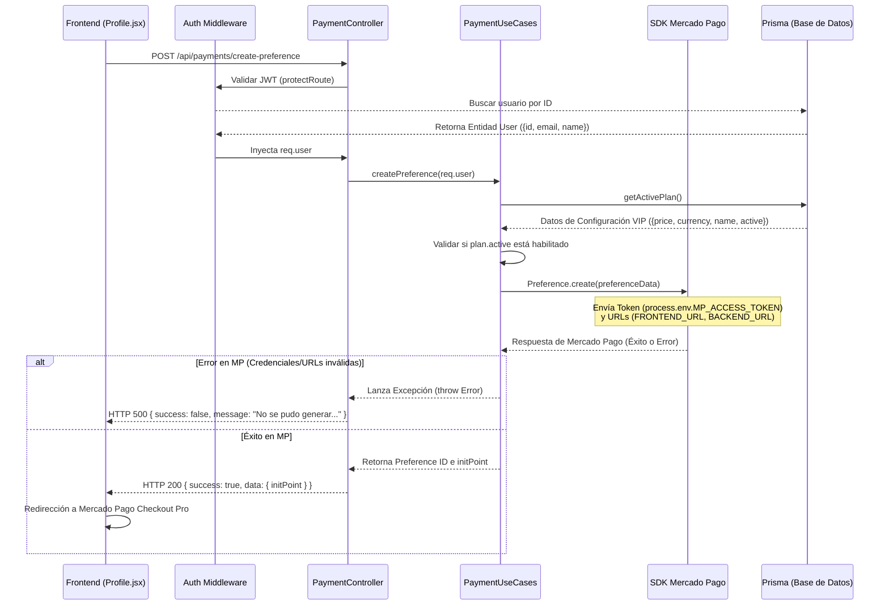

# 🔍 Informe de Auditoría Técnica: Flujo de Creación de Preferencia en Mercado Pago

Esta auditoría técnica describe el análisis del flujo de pagos de PresuApp, identificando el origen del error `"No se pudo generar la preferencia de pago de Mercado Pago."` al presionar el botón "Obtener VIP".

---

## 🛠️ Flujo de Ejecución Analizado

El flujo de extremo a extremo (End-to-End) en la creación de una preferencia de pago sigue la siguiente secuencia:



---

## 📝 Lista de Verificaciones Realizadas

### 1. Registro de Rutas y Controladores
*   **Ruta Registrada**: `/api/payments/create-preference` está correctamente registrada y vinculada a través de `app.js` (`app.use('/api/payments', paymentRoutes)`) y [payment.routes.js](file:///c:/Users/Uriel/Desktop/Presuapp%20v1.0.0/src/interfaces/routes/payment.routes.js#L7).
*   **Controlador Correcto**: `PaymentController.createPreference` se asocia al método `POST` y maneja las excepciones utilizando `next(error)`, pasándolas al handler global.

### 2. Autenticación, Middleware e Inyección de Datos
*   **Protección del Endpoint**: El router utiliza el middleware `protectRoute` (validación de token JWT de tipo Bearer).
*   **Entidad del Usuario**: La entidad `User` se genera en [PrismaUserRepository.js](file:///c:/Users/Uriel/Desktop/Presuapp%20v1.0.0/src/infrastructure/repositories/PrismaUserRepository.js#L23-L30) a partir del modelo de base de datos.
*   **Campos Requeridos**:
    *   `user.id`: Existe (se fuerza su paso a entero: `parseInt`).
    *   `user.email`: Existe y es extraído como string.
    *   `user.name`: Existe y se recupera correctamente.
*   **External Reference**: Se genera como `external_reference: String(user.id)`, lo cual es válido y necesario para asociar la transacción en el webhook.

### 3. Examen e Inicialización de la SDK de Mercado Pago
*   **Versión de la SDK**: La dependencia utilizada es `"mercadopago": "^3.2.0"` (SDK Oficial v3 moderna compatible con ES6).
*   **Inicialización**: Se inicializa en [PaymentUseCases.js](file:///c:/Users/Uriel/Desktop/Presuapp%20v1.0.0/src/application/use-cases/PaymentUseCases.js#L5-L27) mediante:
    ```javascript
    this.mpClient = new MercadoPagoConfig({
      accessToken: process.env.MP_ACCESS_TOKEN
    });
    ```
*   **Checkout Pro / Preference**: El objeto enviado a `this.preference.create()` asocia los campos clave para levantar la pasarela.

### 4. Estructuración de URLs de Retorno y Webhook (Redirección)
*   **URLs del Frontend**: Se concatenan directamente con la variable de entorno:
    ```javascript
    success: `${process.env.FRONTEND_URL}/profile?payment=success`,
    failure: `${process.env.FRONTEND_URL}/profile?payment=failure`,
    pending: `${process.env.FRONTEND_URL}/profile?payment=pending`
    ```
*   **Notification URL (Webhook)**: Se construye como:
    ```javascript
    notification_url: `${process.env.BACKEND_URL}/api/payments/webhook`
    ```
*   [!] **Comprobación de Protocolos**: Mercado Pago **obliga** a que las URLs de retorno y la URL de notificación tengan un formato absoluto y válido (deben iniciar estrictamente con `http://` o `https://`). Además, la `notification_url` requiere resolverse públicamente en internet con protocolo `https`.

---

## 🔍 Análisis de la Causa Raíz del Error

El error se origina cuando `this.preference.create()` es ejecutado y arrojará un error que es capturado por el bloque `try/catch` de `createPreference()`, el cual responde con un error genérico. Según las trazas lógicas, las causas del fallo se clasifican en:

### A. Ausencia o Invalidez de Credenciales en Render (Token MP)
*   **El Token de Pruebas**: Anteriormente, el código contaba con un token de pruebas hardcodeado (`'APP_USR-TEST-MERCADOPAGO-ACCESS-TOKEN'`). Ese token no es válido o está desactualizado a nivel global.
*   **Filtro del Entorno**: Si la variable de entorno `MP_ACCESS_TOKEN` no está configurada o posee un valor inválido en el panel de control de Render para la rama de producción, Mercado Pago rechaza el request arrojando un error **401 Unauthorized**.

### B. Formato Incorrecto o Nulo de URLs en el Entorno del Servidor
*   Al removerse los fallbacks locales, la aplicación depende estrictamente de `process.env.FRONTEND_URL` y `process.env.BACKEND_URL`.
*   Si en las variables de entorno de Render:
    1.  Falta configurar `FRONTEND_URL` o `BACKEND_URL`.
    2.  Están configuradas sin el protocolo (ej: `FRONTEND_URL=presuapp.com` inyectando en su lugar `https://presuapp.com`).
    3.  Tienen una barra inclinada sobrante al final (ej: `https://presuapp.com/`), lo que duplicaría el slash (`https://presuapp.com//profile?payment=success`), resultando en una URL inválida.
*   Mercado Pago rechazará la solicitud de preferencia de inmediato con un error **400 Bad Request** de validación de formato.

### C. Por qué el Webhook responde 200 pero la preferencia falla
*   El Webhook del backend cuenta con un bloque `try/catch` global en el método `webhook` de [PaymentController.js](file:///c:/Users/Uriel/Desktop/Presuapp%20v1.0.0/src/interfaces/controllers/PaymentController.js#L17-L40).
*   En el catch, retorna `res.status(200).json({ success: false, error: error.message });`.
*   Esto asegura que el webhook responda HTTP `200` y parezca "en línea" aunque la integración por debajo no tenga las credenciales cargadas o falle.
*   Sin embargo, el endpoint de **crear preferencia** no tiene este bypass; si la SDK de Mercado Pago devuelve error, el controlador devuelve un HTTP `500` con el mensaje descriptivo `"No se pudo generar la preferencia de pago de Mercado Pago."` disparando la alerta visual del frontend.

---

## 📈 Diagnóstico e Impacto Técnico

*   **Archivo del Fallo**: [PaymentUseCases.js](file:///c:/Users/Uriel/Desktop/Presuapp%20v1.0.0/src/application/use-cases/PaymentUseCases.js).
*   **Método del Fallo**: `createPreference(user)`
*   **Línea aproximada**: Líneas 61 a 71 (llamado a `this.preference.create(preferenceData)`).
*   **Nivel de Gravedad**: **Crítico** (Impide el cobro a clientes y la actualización a VIP de forma normal).
*   **Causa Raíz Principal**: Variable de entorno configurada incorrectamente, incompleta o inexistente en Render (`MP_ACCESS_TOKEN`, `FRONTEND_URL` o `BACKEND_URL`).
*   **Respuesta Recibida por el Frontend**: HTTP 500 JSON.
    ```json
    {
      "success": false,
      "data": null,
      "message": "No se pudo generar la preferencia de pago de Mercado Pago.",
      "error": "No se pudo generar la preferencia de pago de Mercado Pago."
    }
    ```

---

## 🛠️ Cómo Solucionarlo (Paso a Paso)

Para solucionar el inconveniente sin alterar el comportamiento de la aplicación, el Administrador debe verificar la configuración en el panel de variables de entorno de **Render** (sección **Environment Variables** en el dashboard de Render de tu servicio de backend):

### 1. Cargar las Variables con Formato Strict
Asegurarse de que existan y cumplan las siguientes especificaciones:

| Variable | Valor Esperado / Ejemplo | Formato Requerido / Detalle |
| :--- | :--- | :--- |
| **`NODE_ENV`** | `production` | Modo producción. |
| **`MP_ACCESS_TOKEN`** | `APP_USR-8742...-XXXXXX-XXXX...` | Token de acceso de Mercado Pago real (debe ser el token de producción de la cuenta receptora del dinero). |
| **`FRONTEND_URL`** | `https://presuapp.vercel.app` | **Obligatorio**: Debe iniciar con `https://` y **no** debe terminar con `/`. |
| **`BACKEND_URL`** | `https://presuapp-bgpl.onrender.com` | **Obligatorio**: Debe iniciar con `https://`, ser público y **no** debe terminar con `/`. |
| **`JWT_SECRET`** | `tu-secreto-seguro` | La clave de firma de tokens. |

### 2. Modificación de Control de Errores (Opcional en futuro)
Para facilitar el diagnóstico local/producción, en una instancia posterior se puede modificar el catch en [PaymentUseCases.js](file:///c:/Users/Uriel/Desktop/Presuapp%20v1.0.0/src/application/use-cases/PaymentUseCases.js#L79-L82) para que retorne el mensaje nativo de la API de Mercado Pago:

```javascript
    } catch (error) {
      console.error('Error creating Mercado Pago preference:', error);
      // Retornar detalle específico en lugar del error genérico, si aplica:
      throw new Error(`Error de Mercado Pago: ${error.message || 'No se pudo generar la preferencia.'}`);
    }
```
Esto ayudará a visualizar en el frontend de forma explícita si el error es debido a `invalid_access_token` o `invalid_notification_url` sin tener que abrir los logs de Render.
